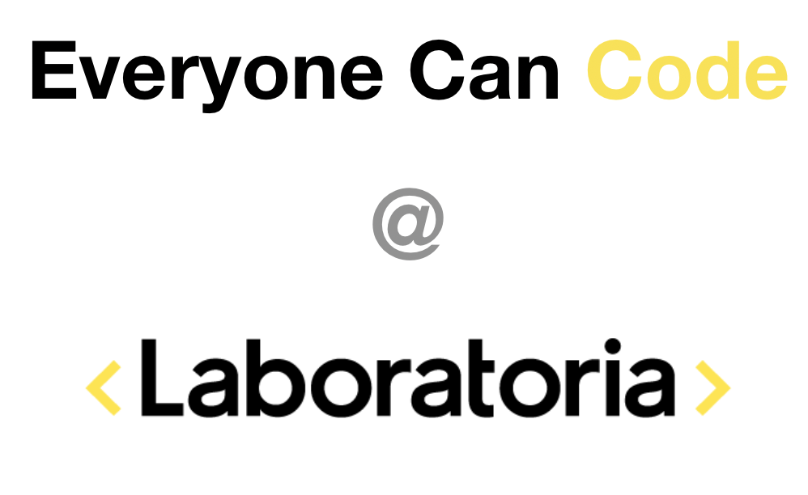
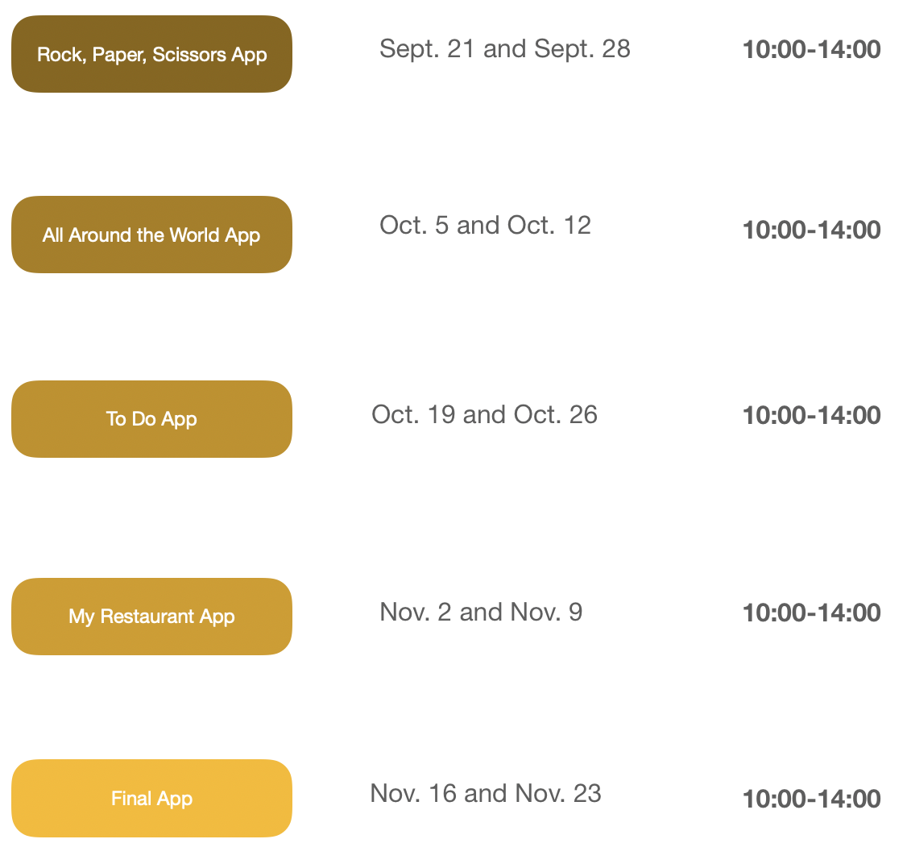

# StartHere



Estos talleres están basados en el programa de Apple [Programación para Todos](https://www.apple.com/mx/everyone-can-code/) y serán adaptados a [Laboratoria](https://www.laboratoria.la/).


## Calendario



---

## Temario

1. Bloque 1: Rock, Paper, Scissors App 
2. Bloque 2: All Around the World App 
3. Bloque 3: To Do App
4. Bloque 4: My Restaurant App 
5. Bloque 5: Final App 

---

### ¿Cómo vamos a estar trabajando?

Para empezar a trabajar dentro de este taller es fundamental que tengas un perfil en Github. Si aún no lo tienes, crea uno pues será la base de todo este curso. A través de esta plataforma, estaremos subiendo las tareas a realizar y la documentación pertinente para el sprint en el que nos encontremos. 

1. Crea un **perfil de Github** y pon una foto de perfil donde aparezcas tu. Esto lo hacemos para que te podamos identificar más rápido. Sin embargo, si no quieres hacerlo, estás en tu derecho y nosotros nos hacemos bolas. :sunglasses:

2. Dentro de tu perfil de Github, crea un repositorio y llámalo **ECC-Laboratoria**. Inicializa tu repositorio con un archivo **README.md**

3. Abre una terminal. 

   - **Ojo, si estás usando Windows**, te recomendamos que descargues el bash de git para Windows, esto facilitará DEMASIADO todo el proceso. Da click en el siguiente link para descargarla: [Git Bash for Windows](https://gitforwindows.org/). Al descargar esta bash, podrás ejecutar todos los comandos dentro de esta bash al igual que un sistema UNIX. 

4. Navega hasta encontrarte dentro de tu escritorio.

   - ```cd Desktop``` o ```cd Escritorio``` 

5. Clona el repositorio que acabas de crear:

   1. ```git clone https://github.com/tuusuario/ECC-Laboratoria ```

6. Dentro de este repositorio, crea una carpeta para cada semana y una carpeta llamada **Proyectos**. Te recomendamos que crees de una vez 10 carpetas con los siguientes nombres: (El comando para crear una carpeta en sistemas UNIX es ```mkdir NombreDeLaCarpeta```) 

   - **Week1**
     - ```mkdir Week1``` 

   - **Week2**
     - ```mkdir Week2```

   - ...

   - **Week10**
     - ```mkdir Week10``` 
   - **Proyectos**
     - ```mkdir Proyectos``` 

7. Entra a cada una de las carpetas (por ejemplo: ```cd Week1```) y crea dos carpetas: 

   1. La primera llámala **Prework**
      - ```mkdir Prework```
   2. La segunda llámala **ProblemSet**
      - ```mkdir ProblemSet```

8. Te recomendamos que para cada carpeta crees un archivo **README.md**. Solo ejecuta el siguiente comando dentro de la carpeta deseada. Por ejemplo, para la semana 1

   1. ```echo "Week1" >> README.md```

9. Una vez que hayas terminado con todas tus carpetas, ejecuta el siguiente comando: 

   1. ```git push``` 
   2. Es posible que tengas que hacer algunas configuraciones. Investiga cómo hacerlo. 

---

## Comunicación con trainers: 

Toda la comunicación con los trainers la estarás llevando a través de Slack. En la primera sesión te daremos información sobre el canal que estaremos usando. 

Sin embargo, si necesitas ayuda más personal no dudes en escribirnos a nuestros correos:

- Néstor Martínez Ostoa | nestor.martinez.98@icloud.com | [nestorivanmo](https://github.com/nestorivanmo)
- Joaquín Ramírez Vila: jramirez.vila@gmail.com

---

## Referencias

- **Introducción al Desarrollo de Apps**. [https://books.apple.com/mx/book/introducci%C3%B3n-al-desarrollo-de-apps-con-swift/id1216831475](https://books.apple.com/mx/book/introducción-al-desarrollo-de-apps-con-swift/id1216831475)
- **App Development with Swift.** https://books.apple.com/us/book/app-development-with-swift/id1219117996
- **The Swift Programming Language Guide.** https://docs.swift.org/swift-book/LanguageGuide/TheBasics.html
- **Apple’s World Wide Developers Conference Videos.** https://developer.apple.com/videos/
- **Human Interface Guidelines: iOS.** https://developer.apple.com/design/human-interface-guidelines/ios/overview/themes/
- **Apple Developer**. https://developer.apple.com/

Otros sitios recomendados:

- **Paul Hudson. Swift in Sixty Seconds.** https://www.hackingwithswift.com/sixty