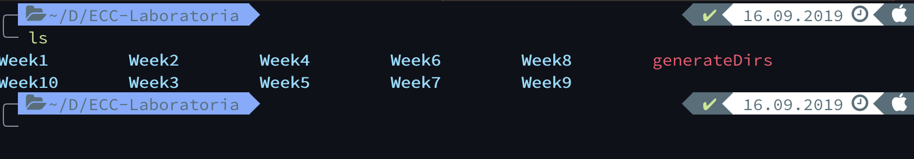
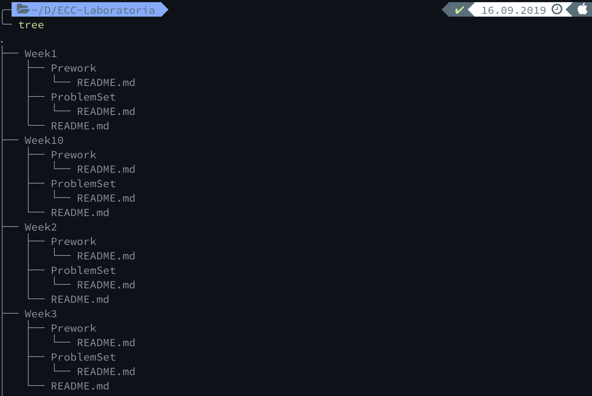

# StartHere


Estos talleres están basados en el programa de Apple [Programación para Todos](https://www.apple.com/mx/everyone-can-code/) y serán adaptados a [Laboratoria](https://www.laboratoria.la/).


## Calendario


---

## Temario

1. Bloque 1: Rock, Paper, Scissors App 
2. Bloque 2: All Around the World App 
3. Bloque 3: To Do App
4. Bloque 4: My Restaurant App 
5. Bloque 5: Final App 

---

## Requerimientos

- MacBook Air, MacBook Pro, iMac 
- Instalar la última versión de [Xcode](https://apps.apple.com/us/app/xcode/id497799835?mt=12)

---

### ¿Cómo vamos a estar trabajando?

Para empezar a trabajar dentro de este taller es fundamental que tengas un perfil en Github. Si aún no lo tienes, crea uno pues será la base de todo este curso. A través de esta plataforma, estaremos subiendo las tareas a realizar y la documentación pertinente para el sprint en el que nos encontremos. 

1. Crea un **perfil de Github** y pon una foto de perfil donde aparezcas tu. Esto lo hacemos para que te podamos identificar más rápido. Sin embargo, si no quieres hacerlo, estás en tu derecho y nosotros nos hacemos bolas. :sunglasses:
2. Dentro de tu perfil de Github, crea un repositorio y llámalo **ECC-Laboratoria**. Inicializa tu repositorio con un archivo **README.md**
3. Abre una terminal. 

   - **Ojo, si estás usando Windows**, te recomendamos que descargues el bash de git para Windows, esto facilitará DEMASIADO todo el proceso. Da click en el siguiente link para descargarla: [Git Bash for Windows](https://gitforwindows.org/). Al descargar esta bash, podrás ejecutar todos los comandos dentro de esta bash al igual que un sistema UNIX. 
4. Navega hasta encontrarte dentro de tu escritorio.

   - ```cd Desktop``` o ```cd Escritorio``` 
5. Clona el repositorio que acabas de crear:
- ```git clone https://github.com/tuusuario/ECC-Laboratoria ```
6. Entra al repositorio que acabas de crear: 
   
   - ```cd ECC-Laboratoria```
   
7. Para facilitarnos el proceso de creación de carpetas, usaremos shell scripting. 

   1. Crea un archivo llamado ```generateDirs```:

      - ```touch generateDirs```

   2. Abre este archivo con tu editor de texto favorito (nosotros usaremos **vi**): 

      - ```vi generateDirs```

   3. Escribe las siguientes líneas de código dentro del archivo:

      - ```
        #!/bin/bash 
        for i in {1..10}
        do
        	mkdir Week$i
        	echo "#Week$i" >> Week$i/README.md
        	mkdir Week$i/Prework
        	echo "##Prework" >> Week$i/Prework/README.md
        	mkdir Week$i/ProblemSet
        	echo "##ProblemSet" >> Week$i/ProblemSet/README.md
        done
        ```

   4. Guarda el archivo: 

      - [esc] + ```:wq```

   5. Necesitamos darn permisos para que podamos ejecutar el script anterior:

      - ```chmod +x generateDirs```

   6. Finalmente, lo corremos: 

      - ```./generateDirs``` 

   7. Comprueba que todo esté funcionando correctamente: 

      - Al ejecutar ```ls```, deberías tener algo como esto: 

      

      - Al ejecutar ```tree```, deberías tener algo como esto: 

      

8. Si no te funciono la forma anterior,  ejecuta los siguientes comandos:
   - ```mkdir Week1```
   - ```touch Week1/README.md```
   - ```mkdir Week1/ProblemSet```
   - ``` echo "##ProblemSet" >> Week1/ProblemSet/README.md```
   - ```mkdir Week1/Prework```
   - ``` echo "##Prework" >> Week1/ProblemSet/README.md```

9. El punto 8 es la estructura de cada una de las semanas. Por lo tanto, hay que repetir la misma estructura para las otras 9 semanas. Ejecuta los siguientes comandos: 
   - ```cp -r Week1 ./Week2```: este comando copiará el contendido del directorio Week1 a un nuevo directorio llamado Week2. 
   - ...
   - ```cp -r Week1 ./Week10```: hay que repetir este comando para cada una de las semanas. 

10. Finalmente, crea una carpeta para proyectos dentro.

   - ```mkdir Proyectos``` 

11. Te recomendamos que para cada carpeta crees un archivo **README.md**. Solo ejecuta el siguiente comando dentro de la carpeta deseada. Por ejemplo, para la semana 1

   1. ```echo "Week1" >> README.md```

12. Una vez que hayas terminado con todas tus carpetas, ejecuta los siguientes comandos: 

    1. ```git add .```
    2. ```git commit -m "Set up listo"```
    3. ```git push``` 
    4. Es posible que tengas que hacer algunas configuraciones. Investiga cómo hacerlo. 

---

## Comunicación con trainers: 

Toda la comunicación con los trainers la estarás llevando a través de Slack. En la primera sesión te daremos información sobre el canal que estaremos usando. 

Sin embargo, si necesitas ayuda más personal no dudes en escribirnos a nuestros correos:

- Néstor Martínez Ostoa | nestor.martinez.98@icloud.com | [nestorivanmo](https://github.com/nestorivanmo)
- Joaquín Ramírez Vila | jramirez.vila@gmail.com | [rmzVila](https://github.com/rmzVila)

---

## Referencias

- **Introducción al Desarrollo de Apps**. [https://books.apple.com/mx/book/introducci%C3%B3n-al-desarrollo-de-apps-con-swift/id1216831475](https://books.apple.com/mx/book/introducción-al-desarrollo-de-apps-con-swift/id1216831475)
- **App Development with Swift.** https://books.apple.com/us/book/app-development-with-swift/id1219117996
- **The Swift Programming Language Guide.** https://docs.swift.org/swift-book/LanguageGuide/TheBasics.html
- **Apple’s World Wide Developers Conference Videos.** https://developer.apple.com/videos/
- **Human Interface Guidelines: iOS.** https://developer.apple.com/design/human-interface-guidelines/ios/overview/themes/
- **Apple Developer**. https://developer.apple.com/

Otros sitios recomendados:

- **Paul Hudson. Swift in Sixty Seconds.** https://www.hackingwithswift.com/sixty